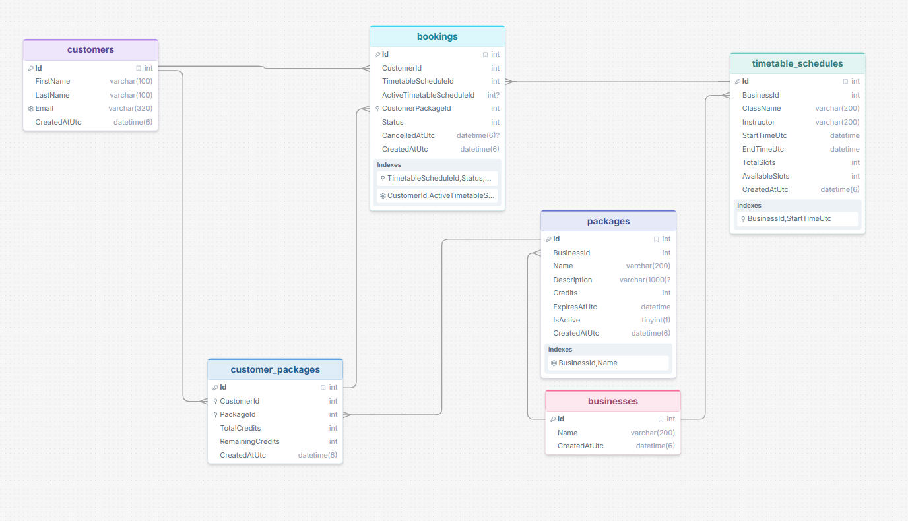

# Rezerv API

Rezerv Booking engine API for fitness studios, with .NET 10, Entity Framework, MySQL

## Projects

- `src/Rezerv.Domain`: entities and shared domain types.
- `src/Rezerv.Application`: commands, DTOs, services, repository abstractions, and booking rules.
- `src/Rezerv.Infrastructure`: Entity Framework Core, MySQL configuration, migrations, and repository implementations.
- `src/Rezerv.Api`: HTTP controllers, request contracts, validation, standard response bodies, Swagger, and health endpoints.

## Architecture

The solution uses a pragmatic Clean Architecture split. The Domain layer contains the booking, timetable, package, business, and customer entities. Application owns use cases and rules, including booking, cancellation, waitlist promotion, cache contracts, and transaction contracts. Infrastructure implements those contracts with Entity Framework Core, MySQL, and Redis. API is the HTTP composition layer and contains controllers, request validation, Swagger, and Hangfire registration.

Dependencies point inward: API depends on Application and Infrastructure, Infrastructure depends on Application and Domain, and Application depends on Domain. This keeps booking rules independent from HTTP and database implementation details while avoiding unnecessary abstractions outside the current use cases.

## Database ERD



## Local setup

Prerequisites: .NET SDK 10, Docker Desktop, and Docker Compose.

1. Start MySQL & Redis with docker script:

	```powershell
	docker compose up -d
	```

2. Apply database migrations:

	 ```powershell
	 dotnet tool run dotnet-ef database update --project src/Rezerv.Infrastructure --startup-project src/Rezerv.Api
	 ```

3. Optionally load demo data: two businesses, ten customers, ten future UTC schedules, three package offers (one expired), customer package balances, and booking scenarios:

	```powershell
	Get-Content scripts/seed-demo-data.sql | docker compose exec -T mysql sh -c 'mysql -u root -p"$MYSQL_ROOT_PASSWORD" rezerv'
	```

4. Run the API:

	 ```powershell
	 dotnet run --project src/Rezerv.Api
	 ```

5. Open `/swagger` while running in the Development environment.

## Tests

Run the full test suite from the repository root:

```powershell
dotnet test
```

Run only the application test project:

```powershell
dotnet test tests/Rezerv.Application.Tests/Rezerv.Application.Tests.csproj
```

Run a specific test flow by filtering on part of its fully qualified name. Replace the value after `~` with the test class or method name:

```powershell
dotnet test --filter "FullyQualifiedName~BookingServiceTests"
dotnet test --filter "FullyQualifiedName~CancelAsync_WhenAtLeastFourHoursBeforeSchedule"
```
## Build

```powershell
dotnet build Rezerv.slnx -c Release
```

## API response body

All controller responses follow this format:

```json
	{
		"success": true,
		"message": "Fetched successfully.",
		"data": {},
		"errors": null
	}
```

## Package APIs

- `GET /api/packages?businessId={businessId}`: lists package offers. The business filter is optional.
- `POST /api/packages`: creates a business-owned package offer.
- `POST /api/packages/purchase`: creates a customer-owned package balance using `customerId` and `packageId`.

## Business APIs

- `GET /api/businesses`: lists businesses.
- `POST /api/businesses`: creates a business using `name`.

## Customer APIs

- `GET /api/customers`: lists customers.
- `POST /api/customers`: creates a customer using `firstName`, `lastName`, and `email`.

## Timetable APIs

- `GET /api/timetable?businessId={businessId}&date={yyyy-MM-dd}`: lists schedules. Both filters are optional and can be used together.
- `POST /api/timetable`: creates a timetable schedule.

## Booking APIs

- `POST /api/bookings`: creates a confirmed booking using `customerId`, `timetableScheduleId`, and `customerPackageId`. It returns `400` with `Schedule is full. Please join the waitlist.` when no slots remain.
- `POST /api/bookings/{bookingId}/cancel`: cancels a confirmed booking and promotes the first eligible waitlisted customer.

## Waitlist APIs

- `POST /api/waitlist`: adds a customer to a full schedule's FIFO waitlist using `customerId`, `timetableScheduleId`, and `customerPackageId`. It returns `400` when the schedule still has a slot, so callers must use `POST /api/bookings` in that case.


## Assumptions

- I treat each booking as a reservation for one slot in one timetable schedule.
- I keep each package purchase as a separate customer package balance, even when the customer buys the same package more than once. I do not combine credits; the customer selects the separate package to use for each booking.
- I allow each customer to have only one active booking or waitlist entry for the same schedule.
- I prevent customers from booking classes that overlap in time, but allow classes that start exactly when another class ends. Businesses may create overlapping timetable schedules because they can run multiple classes concurrently.
- For the waitlist FIFO auto booked scenario, I promote waitlisted customers in the order they joined the queue, using `CreatedAtUtc`; the booking ID breaks a tie when two entries have the same timestamp.
- I require a valid, customer-owned package with at least one credit when joining a waitlist. The credit is deducted only if that entry is promoted to a booking.
- I reject cancellations after a schedule has started. A late cancellation is one made less than four hours before its start and does not receive a credit refund.
- I remove pending waitlist entries once their schedule starts. Hangfire runs this cleanup every minute, so removal can occur up to one minute after the start time. Confirmed and cancelled bookings remain for history.

## Validation and booking rules

All POST request models use FluentValidation. Validation errors are returned in the standard response body's `errors` array.

The booking rule engine enforces these conditions before creating a booking:

- The schedule has not started.
- `AvailableSlots` is greater than zero.
- The customer has at least one package credit.
- The package has not expired and belongs to the schedule's business.
- The customer does not already have a booking for the schedule.
- The customer does not have a confirmed booking that overlaps the requested schedule.

Each booking reserves one slot and consumes one package credit. A cancellation made at least four hours before the schedule refunds one credit; a later cancellation does not refund a credit.

## Concurrency strategy

Booking, waitlist joining, and cancellation acquire a Redis lock scoped to the timetable schedule: `lock:timetable:{timetableScheduleId}`. The lock retries briefly before returning a busy error, preventing competing requests from changing the same schedule's slot count at the same time.

After acquiring the lock, the operation runs in a MySQL serializable transaction. Slot counts, credit balances, booking status, cancellation state, and FIFO promotion are committed atomically. The unique index on `CustomerId` and `ActiveTimetableScheduleId` remains a database-level guard against duplicate active entries even if a Redis lock expires or an application instance fails.

## Background jobs

Hangfire uses the configured MySQL connection for persistent jobs. It removes pending waitlist entries for schedules that have started every minute. In the Development environment, the dashboard is available at `/hangfire`.

## Health checks

- `GET /api/health`: API controller health response.
- `GET /health`: liveness probe without a database dependency.
- `GET /health/ready`: MySQL readiness probe.

## Tradeoffs

- I store times in UTC and use `UTC_TIMESTAMP(6)` in demo data. This makes cancellation windows and overlap checks consistent across developer machines and deployments; clients should convert times for display.
- I keep a customer package purchase as a separate balance instead of merging purchases. This makes credit consumption and refunds traceable, but the client must choose the balance to use.
- I use `ActiveTimetableScheduleId` alongside the permanent schedule foreign key. A nullable active key allows a database unique index to prevent duplicate active booking/waitlist entries while preserving cancelled booking history and allowing a later rebooking.
- Timetable and package lists use short-lived Redis cache-aside entries. This reduces repeated reads but accepts up to one minute of stale list data; relevant cache keys are invalidated after writes.
- A waitlist entry must have a valid package and available credit when it joins, but its credit is deducted only at promotion. This avoids queuing entries that are already ineligible, while still rechecking all conditions at promotion time.

## Future package validity model

The current package offer uses a fixed `ExpiresAtUtc` value, so every customer who purchases that offer shares the same expiry date. This is suitable for a time-limited campaign, but it is not flexible for a reusable package catalog.

For a future iteration, I would replace the package offer's fixed expiry with `ValidityDays`. For example, a "10 Class Pack" could have `ValidityDays = 30`. When a customer purchases it, the system would set `CustomerPackage.PurchasedAtUtc` to the purchase time and calculate `CustomerPackage.ExpiresAtUtc = PurchasedAtUtc + ValidityDays`. Booking and waitlist validation would use the customer package expiry, not the package offer expiry.

This preserves the terms accepted at purchase time: changing `ValidityDays` on an offer affects only future purchases, while existing customer package balances retain their original calculated expiry date.

## Production scaling

- Run multiple stateless API instances behind a load balancer. Redis schedule locks and MySQL transactions retain booking correctness across instances.
- Run Hangfire workers separately from the API when job volume grows, using the same persistent Hangfire storage and explicit queue/concurrency settings.
- Add pagination and a required or bounded date range to the timetable list before schedules become large. Keep the current business/date index and add query-specific indexes after observing production query plans.
- Add structured logs, metrics, tracing, lock-contention monitoring, and alerts for failed Hangfire jobs, cache failures, and slow MySQL transactions.
- For customer notifications or external payment flows, publish events through an outbox in the same transaction, then process them asynchronously. This keeps booking commits fast and prevents losing notifications after a successful database commit.
- Keep backups, migration rollout checks, Redis high availability, secrets management, HTTPS termination, authentication, and authorization in the deployment platform. The current API is intentionally unauthenticated for the assignment workflow.


